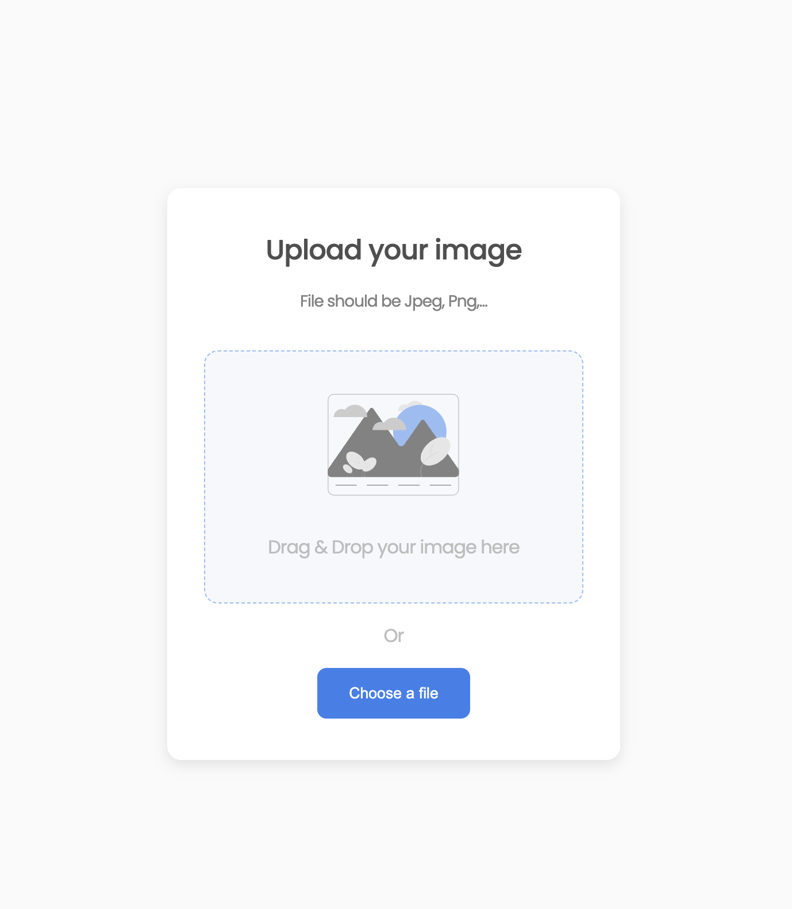

<h1 align="center">devio-image-uploader</h1>

   Solution for a challenge from  <a href="http://devchallenges.io" target="_blank">Devchallenges.io</a>.

  <h3>
    <a href="https://devio-file-uploader.web.app/">
      Demo
    </a>
     | 
    <a href="https://github.com/lipe11/devio-image-uploader">
      Solution
    </a>
     | 
    <a href="https://devchallenges.io/challenges/O2iGT9yBd6xZBrOcVirx">
      Challenge
    </a>
  </h3>

## Table of Contents

- [Table of Contents](#table-of-contents)
- [Overview](#overview)
  - [Built With](#built-with)
- [Features](#features)
- [Contact](#contact)

## Overview

This project helped me learn about things I never tried before, like the drag and drop functionality, copy to clipboard, and using firebase storage.

### Built With

- [Vue.js](https://vuejs.org/)
- [Firebase](https://firebase.google.com/)

## Features

This application/site was created as a submission to a [DevChallenges](https://devchallenges.io/challenges) challenge. The [challenge](https://devchallenges.io/challenges/O2iGT9yBd6xZBrOcVirx) was to build an application to complete the given user stories.

## Contact

- GitHub [@lipe11](https://github.com/lipe11)
